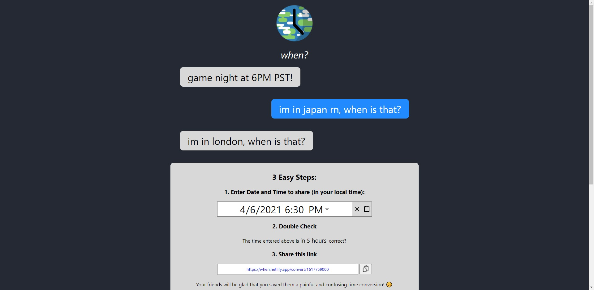
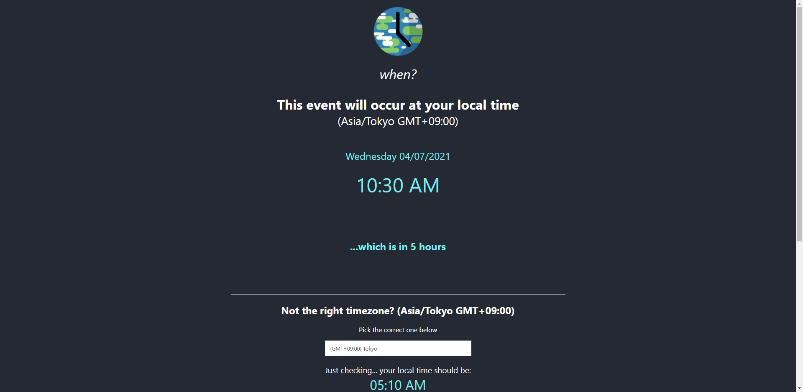

# when?

Tired of having to convert to everyone's timezone in a group chat? With *when?*, you can send a single link and when your friends open it up, it will be in their local time!

Built with Next.js, hosted on Netlify. Used Day.js for time converting.

## Visit now
[when](https://when.netlify.app)
