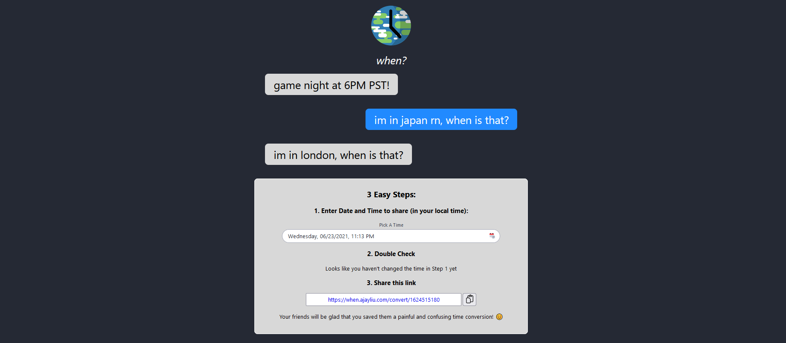

[](https://app.netlify.com/sites/when/deploys)

<p align="center">
  <a href="https://github.com/AjayLiu/when">
    
  </a>

  <h3 align="center">When?</h3>

  <p align="center">      
    Tired of having to convert to everyone's timezone in a group chat?
    <br />
    With <em>When?</em>, you can send a single link and when your friends open it up, it will be in their local time!
    <br />
    <a href="https://when.ajayliu.com"><strong>Website »</strong></a>
  </p>
</p>


<!-- TABLE OF CONTENTS -->
<details open="open">
  <summary>Table of Contents</summary>
  <ol>
    <li>
      <a href="#about-the-project">About The Project</a>
      <ul>
        <li><a href="#built-with">Built With</a></li>
      </ul>
    </li>
    <li>
      <a href="#getting-started">Getting Started</a>
      <ul>
        <li><a href="#prerequisites">Prerequisites</a></li>
        <li><a href="#installation">Installation</a></li>
        <li><a href="#development">Development</a></li>
        <li><a href="#deployment">Deployment</a></li>
      </ul>
    </li>
    <li><a href="#license">License</a></li>
    <li><a href="#contact">Contact</a></li>
    <li><a href="#acknowledgements">Acknowledgements</a></li>
  </ol>
</details>


<!-- ABOUT THE PROJECT -->
## About The Project

</img>

This site uses links which contain a UNIX timestamp (ex: 1624515180), or how many seconds have passed since January 1, 1970. This information is then converted using Day.js when the user opens up the link, to their respective local times. 

### Built With
* [Next.js](https://nextjs.org/)
* [React](https://reactjs.org/)
* [SCSS](https://sass-lang.com/)
* [Netlify](https://www.netlify.com/)


<!-- GETTING STARTED -->
## Getting Started

Here is a guide if you want to clone my website and modify it for yourself, all the way to deployment.

### Prerequisites

* [yarn](https://yarnpkg.com/)
* [git](https://git-scm.com/)

### Installation

1. Clone the repo
   ```sh
   git clone https://github.com/AjayLiu/when.git
   ```
2. Install packages
   ```sh
   yarn
   ```

### Development

To run the development server
   ```sh
   yarn dev
   ```
Then head over to localhost:3000

### Deployment
1. Publish the site on Netlify using continuous git integration. :tada:

<!-- LICENSE -->
## License

Distributed under the MIT License. See `LICENSE` for more information.


<!-- CONTACT -->
## Contact

Ajay Liu - contact@ajayliu.com

Project Link: [https://github.com/AjayLiu/when](https://github.com/AjayLiu/when)


<!-- ACKNOWLEDGEMENTS -->
## Acknowledgements
* [Day.js](https://day.js.org/)
* [react-rainbow-components](https://react-rainbow.io/)
* [react-bootstrap-timezone-picker](https://www.npmjs.com/package/react-bootstrap-timezone-picker)
* [Netlify](https://www.netlify.com/)
